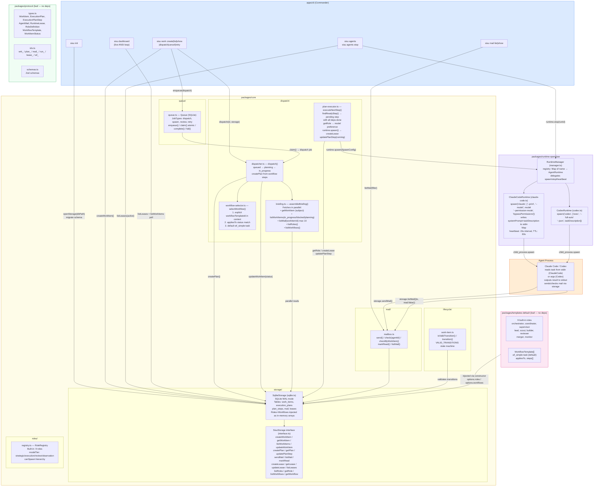
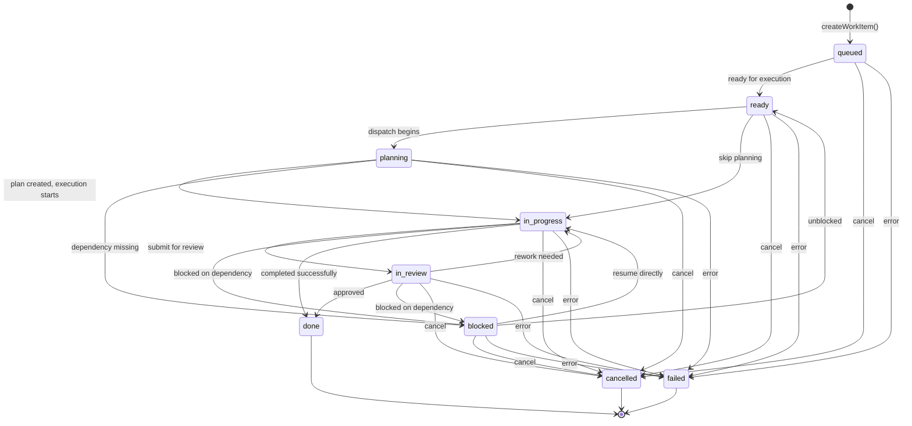
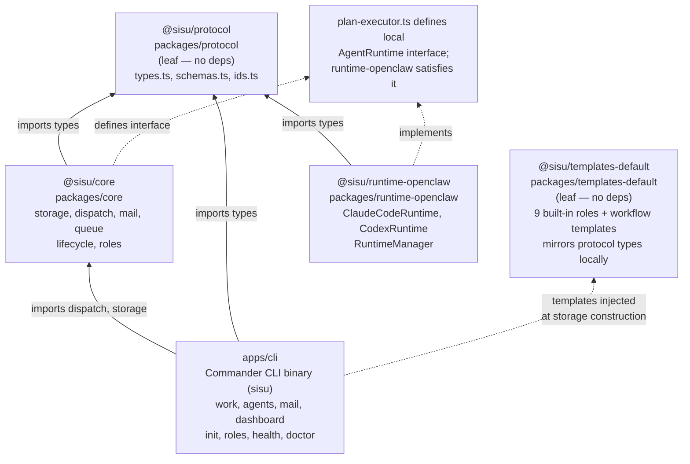

# SISU Architecture Diagrams

Mermaid diagrams showing the current MVP design. All diagrams reflect actual code, not aspirational features.

---

## 1. MVP Architecture Flowchart

Complete data flow through all packages: CLI → Core (Storage, Dispatch, Mail, Queue) → Runtime → Agent.



---

## 2. UML Sequence Diagram

Full lifecycle: init, create work item, dispatch, plan execution, agent spawn, heartbeats, mail exchange, completion, and monitoring.

```mermaid
sequenceDiagram
    participant User
    participant CLI as CLI (apps/cli)
    participant Storage as Storage (SqliteStorage)
    participant Lifecycle as Lifecycle (work-item.ts)
    participant Queue as Queue (SQLite jobs)
    participant Dispatch as Dispatcher (dispatcher.ts)
    participant PlanExec as PlanExecutor (plan-executor.ts)
    participant Mailbox as Mailbox (mail/mailbox.ts)
    participant RTMgr as RuntimeManager
    participant Runtime as ClaudeCodeRuntime
    participant Agent as Agent Process

    Note over User,Storage: 1. Initialization
    User->>CLI: sisu init [--db path]
    CLI->>Storage: openStorage(dbPath) — create DB, run migrations
    Storage-->>CLI: SisuStorage instance (WAL mode, tables created)

    Note over User,Storage: 2. Work Item Creation
    User->>CLI: sisu work create --title "..."
    CLI->>Storage: createWorkItem({ title, metadata })
    Storage-->>CLI: WorkItem { id: wrk_xxx, status: "queued", version: 1 }
    CLI-->>User: Created work item wrk_xxx

    Note over CLI,Queue: 3. Queue Dispatch Job
    User->>CLI: sisu work dispatch wrk_xxx
    CLI->>Queue: enqueue({ type: "dispatch", payload: { workItemId } })
    Queue-->>CLI: Job { id: job_xxx, status: "pending" }

    Note over Queue,Dispatch: Queue Worker Claims Job
    Queue->>Queue: claim() — atomic transaction (SELECT + UPDATE pending→claimed)
    Queue-->>Dispatch: Job { type: "dispatch", payload: { workItemId } }

    Note over Dispatch,Storage: 4a. Briefing Assembly (parallel fetches)
    Dispatch->>Storage: assembleBriefing("dispatch", workItemId)
    par
        Storage->>Storage: getWorkItem(workItemId)
    and
        Storage->>Storage: listWorkItems({ status: [in_progress, blocked, planning] })
    and
        Storage->>Storage: listMail({ workItemId }) — max 10, newest first
    and
        Storage->>Storage: listRoles()
    and
        Storage->>Storage: listWorkflows()
    end
    Storage-->>Dispatch: CoordinatorBriefing { subject, activeItems, recentMail, roles, workflows }

    Note over Dispatch,Lifecycle: 4b. Status Transition queued → planning
    Dispatch->>Storage: updateWorkItem(id, { status: "planning" })
    Lifecycle->>Lifecycle: isValidTransition("queued", "planning") ✓
    Storage-->>Dispatch: WorkItem { status: "planning", version: 2 }

    Note over Dispatch: 4c. Workflow Selection
    Dispatch->>Dispatch: selectWorkflow(workItem, workflows)
    Note right of Dispatch: 1. context.workflowTemplateId (explicit)?<br/>2. workflow.appliesTo includes status?<br/>3. default: wf_simple-task

    Note over Dispatch,Storage: 4d. Plan Creation
    Dispatch->>Storage: createPlan({ workItemId, workflowTemplateId, steps[] })
    Storage-->>Dispatch: ExecutionPlan { id: plan_xxx, steps: [{ id, role, status: "pending" }] }

    Note over Dispatch,Lifecycle: 4e. Status Transition planning → in_progress
    Dispatch->>Storage: updateWorkItem(id, { status: "in_progress" })
    Lifecycle->>Lifecycle: isValidTransition("planning", "in_progress") ✓
    Storage-->>Dispatch: WorkItem { status: "in_progress", version: 3 }

    Note over PlanExec,Runtime: 5. Plan Step Execution
    Dispatch->>PlanExec: executeNextStep(plan, storage, runtime)
    PlanExec->>PlanExec: findReadyStep(plan) — pending step, all deps done
    PlanExec->>Storage: getRole(step.role)
    Storage-->>PlanExec: RoleDefinition { modelPreference: "claude-sonnet-4-6" }
    PlanExec->>RTMgr: runtime.spawn(SpawnConfig { runId: run_xxx, role, model, workItemId, planId, systemPrompt, taskDescription })
    RTMgr->>Runtime: spawn(config)
    Runtime->>Agent: child_process.spawn("claude", ["--print", "--model", "claude-sonnet-4-6", "--permission-mode", "bypassPermissions"])
    Agent->>Agent: stdin.write(systemPrompt + "\n\n" + taskDescription); stdin.end()
    Agent-->>Runtime: ChildProcess { pid }
    Runtime-->>RTMgr: AgentHandle { runId: run_xxx, pid, status: "spawning" }
    RTMgr-->>PlanExec: AgentHandle
    Runtime->>Runtime: process 'spawn' event → status = "active"

    PlanExec->>Storage: createLease({ runId, role, workItemId, planId, model })
    Storage-->>PlanExec: RuntimeLease { id: lease_xxx, runId, active: true, expiresAt }
    PlanExec->>Storage: updatePlanStep(planId, stepId, { status: "running", runId, startedAt })
    Storage-->>PlanExec: ExecutionPlan (step status: "running")

    Note over Runtime,Storage: 6. Heartbeats (every 15s, TTL 60s)
    loop every 15 seconds
        Runtime->>Runtime: heartbeat(runId) — check processes Map
        Runtime-->>RTMgr: LeaseStatus { status: "active", heartbeatAt, expiresAt }
        RTMgr->>Storage: updateLease(leaseId, { lastHeartbeat, expiresAt })
    end

    Note over Agent,Mailbox: 7. Agent Mail Exchange
    Agent->>Mailbox: storage.sendMail({ from: agentId, to: coordinator, type: "status", subject, body, workItemId })
    Mailbox->>Storage: sendMail(input)
    Storage-->>Mailbox: AgentMail { id: mail_xxx, createdAt }

    User->>CLI: sisu mail list
    CLI->>Mailbox: check(agentId, storage) — listMail({ to, read: false })
    Mailbox->>Storage: listMail({ to: agentId, read: false })
    Storage-->>Mailbox: AgentMail[]
    Mailbox-->>CLI: unread messages
    CLI->>Mailbox: markRead(mailId, storage)
    Mailbox->>Storage: markRead(mailId)

    Note over Agent,Storage: 8. Agent Completion
    Agent->>Agent: task complete → exit code 0
    Runtime->>Runtime: process 'exit' handler → status = "active" (code 0)
    PlanExec->>Storage: updatePlanStep(planId, stepId, { status: "done", completedAt })
    Storage-->>PlanExec: ExecutionPlan (step status: "done")

    PlanExec->>PlanExec: findReadyStep(plan) — next pending step?
    alt more steps ready
        PlanExec->>RTMgr: runtime.spawn(nextStep)
    else all steps done
        PlanExec->>Storage: updateWorkItem(id, { status: "done" })
        Lifecycle->>Lifecycle: isValidTransition("in_progress", "done") ✓
        Storage-->>PlanExec: WorkItem { status: "done" }
        Queue->>Queue: complete(jobId, result)
    end

    Note over User,Storage: 9. Monitoring
    User->>CLI: sisu agents
    CLI->>Storage: listLeases({ active: true })
    Storage-->>CLI: RuntimeLease[]
    CLI-->>User: active agents table

    User->>CLI: sisu dashboard
    CLI->>CLI: setInterval → poll listWorkItems + listLeases
    CLI-->>User: live ANSI terminal display
```

---

## 3. Work Item State Machine

Exact `VALID_TRANSITIONS` from `packages/core/src/lifecycle/work-item.ts`.



---

## 4. Package Dependency Graph

Inter-package dependencies within the pnpm workspace.


