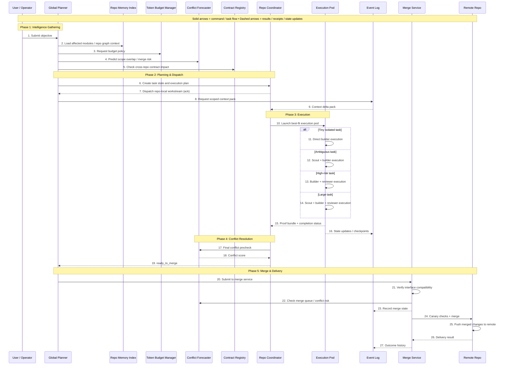
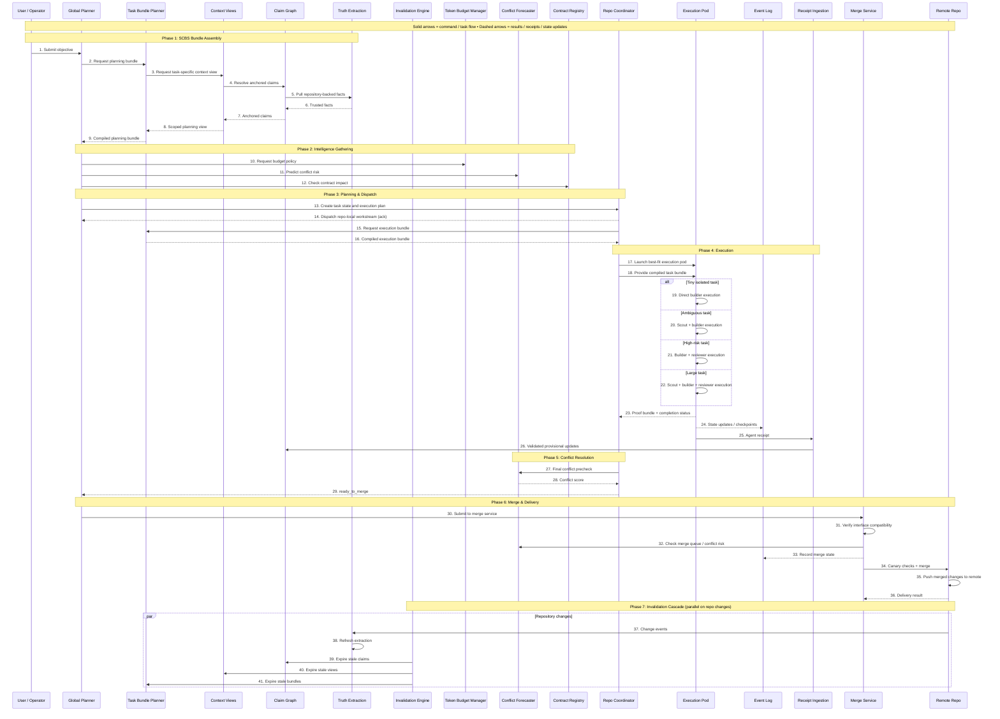

SISU
API-native orchestration engine for AI agent workflows. Separate repository, scalable role system, pluggable multi-model runtimes, and contract-first integration with Mission Control.

Every agent in SISU is a real LLM-powered brain - not a code-based script, not a deterministic if/else loop, not a cron job pretending to be intelligent. The coordinator THINKS. The lead REASONS about decomposition. The builder WRITES code through a real coding agent session. The reviewer EVALUATES with judgment. Every role is an AI brain backed by the best-fit model for its job.

Replaces hardcoded in-app orchestration with a standalone engine built for long-term scale: versioned APIs, extensible role and capability registries, isolated execution control, multi-model agent routing, and clean compatibility with Mission Control as both systems evolve. Mission Control stays the product. SISU becomes the orchestration brain behind an API boundary.

Why
Hardcoding the engine into Mission Control is fast at first, but it creates long-term drag:

Tight coupling to product internals - every engine change touches app code, and every app feature risks breaking orchestration
No stable contract - task models, agent state, and execution flows leak through internal imports instead of a versioned API
Weak extensibility - adding new agent roles, runtimes, or workflow types requires engine-core edits instead of registry/config changes
Feature friction - when Mission Control adds new domains (Office, Docs, Calendar, Projects, etc.), SISU compatibility becomes a custom rewrite instead of adapter work
Deployment lockstep - engine improvements can't ship independently from Mission Control releases
Scalability ceiling - in-process orchestration is harder to scale horizontally, observe, retry, and isolate
No clean reuse - hardcoded SISU cannot later power other products, sandboxes, or automation surfaces without extraction work
Mission Control needs an engine that can evolve independently while remaining easy to integrate. SISU covers exactly that surface.

Design Principles
AI brains, not code agents. Every SISU role is a real LLM-powered agent session — not a deterministic script, not a state machine, not a cron loop. Agents reason, judge, adapt, and make decisions. Code handles plumbing (queues, state, routing). AI handles thinking (planning, decomposition, review, execution).
Multi-model by design. Different roles need different models. The coordinator needs deep reasoning (Opus 4.6). Builders need fast code execution (GPT 5.4 / Codex / Claude Code). Monitors need cheap observation (Haiku). Model routing is a first-class concern configured per role, not an afterthought.
API-first, not app-first. SISU must never import Mission Control internals. Communication happens through versioned HTTP APIs, webhooks, and shared protocol packages.
Mission Control compatibility is a product requirement. New Mission Control features must integrate through adapters, capabilities, and metadata — not engine rewrites.
The coordinator is an AI, not a cron loop. SISU's central decision-maker reasons about dispatch, blockers, decomposition, rework, and priority. It receives structured context and makes strategic decisions — not pattern-matched if/else branches.
Hierarchy is enforced, not implied. Role permissions, spawn relationships, and write access are defined in code and validated at runtime.
Mail is the protocol. Inter-agent communication must be explicit, typed, auditable, and transport-independent.
Capabilities are extensible. New features and new agents integrate through registries and schema contracts, not hardcoded condition trees.
Runtimes are pluggable. OpenClaw is the default runtime adapter, but the engine must support Claude Code, Codex, Gemini CLI, Pi, and future runtimes without changing core orchestration logic. Each runtime maps to one or more LLM models.
Horizontal scale comes first. SISU should run as a stateless API/service layer backed by durable storage, queue semantics, and idempotent event handling.
Schema evolution must be additive by default. Forward compatibility matters. Unknown fields should survive round-trips through metadata bags and versioned envelopes.
Mission Control is the control surface, SISU is the execution brain. The product owns UX and domain presentation. SISU owns orchestration logic and execution state.
Stateless coordinator turns, not long-running sessions. The coordinator must NEVER be a long-running session that accumulates context until the window fills and quality degrades. Each coordinator decision is a fresh invocation with a curated context briefing assembled from storage. The coordinator reads, decides, writes back, and dies. Storage is the memory, not the context window. This is the bridge pattern to SCBS — when SCBS is ready, the briefing assembly becomes a real bundle request.

Architecture Components
SISU's runtime architecture consists of 11 components organized into three layers: Control, Execution, and Merge. This is the canonical architecture — all implementation must map to these components.

Control Layer
User / Operator
The human or external system that submits objectives into SISU. In Mission Control context, this is the MC adapter translating user actions into SISU work items. The operator submits objectives, receives completion notifications, and can intervene on blocked or failed work.

Global Planner
The strategic brain of SISU. An AI-powered (Opus-tier) stateless decision-maker that:
- Receives objectives from the operator
- Gathers intelligence from Repo Memory Index, Token Budget Manager, Conflict Forecaster, and Contract Registry before making decisions
- Creates task state and execution plans
- Dispatches repo-local workstreams to Repo Coordinators
- Receives ready_to_merge signals and submits work to the Merge Service
- Makes decomposition decisions (split large objectives into sub-tasks)

The Global Planner is NOT a long-running session. Each decision is a fresh LLM invocation with a curated context briefing. It reads, decides, writes, and dies. Storage is the memory.

Repo Memory Index
Persistent knowledge store of repository structure, module graph, file ownership, dependency maps, and historical context. The Global Planner queries this to understand what modules are affected by an objective and what context is relevant.

When SCBS is integrated, the Repo Memory Index becomes backed by SCBS bundles (facts → claims → views) instead of raw file scanning.

interface RepoMemoryQuery {
  objectiveId: string;
  scope: string[];           // file paths, module names, or "auto"
  depth: "shallow" | "deep"; // shallow = direct deps, deep = transitive
}

interface RepoMemoryResult {
  affectedModules: string[];
  dependencyGraph: Record<string, string[]>;
  recentChanges: { path: string; author: string; age: string }[];
  knownContracts: string[];  // contract IDs touching these modules
  contextSize: number;       // estimated tokens
}

Token Budget Manager (S1)
Tracks and enforces token budgets across the entire system. Every agent spawn, every briefing assembly, every context pack has a token cost. The Token Budget Manager:
- Provides budget policies to the Global Planner before dispatch
- Tracks cumulative spend per work item, per agent, per project
- Enforces hard limits and soft warnings
- Enables cost-aware routing (prefer cheaper models when budget is tight)
- Reports spend analytics for billing and optimization

interface TokenBudgetPolicy {
  workItemId: string;
  maxTokens: number;           // hard ceiling for this work item
  warningThreshold: number;    // soft warning at this level
  currentSpend: number;        // tokens consumed so far
  perAgentLimit?: number;      // max tokens per individual agent spawn
  modelPreference?: string;    // budget-driven model suggestion
}

Conflict Forecaster (S2)
Predicts scope overlap and merge risk BEFORE work begins, and validates conflict state AFTER work completes. Consulted at two points:
1. Pre-dispatch: Global Planner asks "will this work conflict with anything in progress?"
2. Pre-merge: Repo Coordinator asks "is it safe to merge this now?"

interface ConflictPrediction {
  workItemId: string;
  riskScore: number;           // 0.0 (safe) to 1.0 (certain conflict)
  overlappingItems: string[];  // work item IDs touching same files/modules
  overlappingFiles: string[];  // specific file paths at risk
  recommendation: "proceed" | "serialize" | "manual_review";
}

interface ConflictCheck {
  workItemId: string;
  conflictScore: number;       // post-completion conflict assessment
  mergeBlocking: boolean;      // true = cannot auto-merge
  details: string;             // human-readable conflict description
}

Contract Registry (S3)
Tracks cross-repo and cross-module interface contracts. When work touches a module boundary, the Contract Registry answers: "will this break any contract?"

interface ContractImpact {
  workItemId: string;
  affectedContracts: {
    contractId: string;
    type: "api" | "schema" | "interface" | "protocol";
    breakingChange: boolean;
    affectedConsumers: string[];
  }[];
  recommendation: "safe" | "review_required" | "breaking_change";
}

Repo Coordinator
The tactical execution manager for a specific repository or workstream. Receives dispatched work from the Global Planner and manages the full execution lifecycle:
- Requests scoped context packs from the Event Log / Repo Memory Index
- Selects and launches the best-fit execution pod
- Monitors pod execution via heartbeats and status updates
- Collects proof bundles and completion status from pods
- Runs final conflict precheck via the Conflict Forecaster
- Signals ready_to_merge back to the Global Planner

In a multi-repo objective, each repo gets its own Repo Coordinator instance. The Global Planner coordinates across them.

Execution Layer
Execution Pod
The actual agent team that does the work. Pods are composed based on task characteristics:

| Pod Type | Composition | When Used |
|---|---|---|
| Direct builder | Builder only | Tiny, isolated tasks with clear scope |
| Scout + builder | Scout → Builder | Ambiguous tasks needing research first |
| Builder + reviewer | Builder → Reviewer | High-risk tasks needing validation |
| Full squad | Scout → Builder → Reviewer | Large tasks needing research, execution, and review |

Each agent in the pod is a real LLM brain session spawned via the runtime adapter. Agents communicate through SISU mail. The pod composition is determined by the Repo Coordinator based on task kind, risk assessment, and workflow template.

Merge Layer
Merge Service
Handles the final integration of completed work into the canonical branch:
1. Receives merge submissions from the Global Planner
2. Verifies interface compatibility (contract checks)
3. Checks merge queue ordering and conflict risk via the Conflict Forecaster
4. Performs canary checks (lint, typecheck, test subset)
5. Executes the actual merge
6. Pushes to the Remote Repo
7. Reports delivery result

The Merge Service is NOT a dumb git merge. It's an intelligent gate that prevents broken code from reaching the canonical branch.

interface MergeRequest {
  workItemId: string;
  sourceBranch: string;
  targetBranch: string;
  conflictScore: number;      // from Conflict Forecaster
  proofBundle: {
    testsPass: boolean;
    lintPass: boolean;
    typecheckPass: boolean;
    reviewApproved: boolean;
    coverageDelta: number;
  };
}

interface MergeResult {
  workItemId: string;
  status: "merged" | "rejected" | "conflict" | "canary_failed";
  commitSha?: string;
  rejectionReason?: string;
}

Remote Repo
The canonical source of truth (GitHub, GitLab, etc.). SISU pushes merged changes here and records delivery results. The Remote Repo is external to SISU — it's the integration boundary.

Shared Services
Event Log (S4)
The system-wide audit trail and state checkpoint store. Every significant state transition, agent action, and decision is recorded:
- Work item status transitions
- Agent spawn/stop/heartbeat events
- Mail sent/received
- Merge attempts and results
- Conflict predictions and checks
- Budget spend events
- Context pack requests and responses

The Event Log serves dual purposes:
1. Audit: complete history of what happened and why
2. Context: the Repo Coordinator queries recent events to build context delta packs for agents

interface EventLogEntry {
  id: string;                  // "evt_{ulid}"
  timestamp: string;
  category: "work_item" | "agent" | "mail" | "merge" | "conflict" | "budget" | "context" | "system";
  action: string;              // e.g. "status_transition", "agent_spawned", "merge_completed"
  workItemId?: string;
  agentRunId?: string;
  payload: Record<string, unknown>;
}

Outcome Learner (S5)
Observes completed work items and learns which pod compositions, model choices, and workflow templates produce the best results. Provides routing hints to the Global Planner for future dispatch decisions:
- Tracks success/failure rates per pod type per task kind
- Measures token efficiency (cost per successful completion)
- Identifies patterns (e.g. "scout+builder works better than direct builder for tasks touching >5 files")
- Feeds routing suggestions back into the Global Planner's briefing

This is the self-improvement loop. SISU gets smarter at dispatching over time.

interface OutcomeRecord {
  workItemId: string;
  kind: string;
  podType: string;
  models: string[];
  tokensUsed: number;
  wallTimeMs: number;
  result: "success" | "failed" | "rework";
  reworkCount: number;
  filesChanged: number;
  complexity: number;          // estimated from scope
}

interface RoutingHint {
  taskKind: string;
  recommendedPod: string;
  recommendedModels: Record<string, string>;
  confidence: number;          // 0.0 to 1.0 based on sample size
  sampleSize: number;
}

Sequence Diagram (Base Architecture)

Execution Flow (27 Steps)
This is the canonical sequence for a SISU objective from submission to merge:

Phase 1: Intelligence Gathering (Steps 1-5)
1. User/Operator → Global Planner: Submit objective
2. Global Planner → Repo Memory Index: Load affected modules / repo graph context
3. Global Planner → Token Budget Manager: Request budget policy
4. Global Planner → Conflict Forecaster: Predict scope overlap / merge risk
5. Global Planner → Contract Registry: Check cross-repo contract impact

Phase 2: Planning & Dispatch (Steps 6-9)
6. Global Planner → Repo Coordinator: Create task state and execution plan
7. Repo Coordinator → Global Planner: Dispatch repo-local workstream (ack)
8. Global Planner → Event Log: Request scoped context pack
9. Event Log → Repo Coordinator: Context delta pack

Phase 3: Execution (Steps 10-16)
10. Repo Coordinator → Execution Pod: Launch best-fit execution pod
    - [Tiny isolated task] → Direct builder execution
    - [Ambiguous task] → Scout + builder execution
    - [High-risk task] → Builder + reviewer execution
    - [Large task] → Scout + builder + reviewer execution
11-14. Execution Pod: Agents execute within the pod (internal mail, tool use, code changes)
15. Execution Pod → Repo Coordinator: Proof bundle + completion status
16. Event Log: State updates / checkpoints (continuous throughout execution)

Phase 4: Conflict Resolution (Steps 17-19)
17. Repo Coordinator → Conflict Forecaster: Final conflict precheck
18. Conflict Forecaster → Repo Coordinator: Conflict score
19. Repo Coordinator → Global Planner: ready_to_merge

Phase 5: Merge & Delivery (Steps 20-27)
20. Global Planner → Merge Service: Submit to merge service
21. Merge Service: Verify interface compatibility
22. Merge Service → Conflict Forecaster: Check merge queue / conflict risk
23. Event Log: Record merge state
24. Merge Service → Remote Repo: Canary checks + merge
25. Remote Repo: Push merged changes to remote
26. Remote Repo → Merge Service: Delivery result
27. Event Log: Outcome history (feeds Outcome Learner)

Flow Rules:
- Solid arrows = command / task flow (imperative actions)
- Dashed arrows = status / result flow (responses and state updates)
- The Global Planner MUST gather intelligence (steps 2-5) before creating an execution plan
- The Repo Coordinator MUST run conflict precheck before signaling ready_to_merge
- The Merge Service MUST verify interface compatibility and run canary checks before merging
- Every state transition is recorded in the Event Log
- The Outcome Learner processes completed work items asynchronously to improve future routing

Component-to-Package Mapping
Architecture Component → Code Package:
- Global Planner → @sisu/core/dispatch (AI brain, briefing assembly, dispatch logic)
- Repo Memory Index → @sisu/core/context (repo scanning, module graph, SCBS bridge)
- Token Budget Manager → @sisu/core/budget (spend tracking, policy enforcement)
- Conflict Forecaster → @sisu/core/conflict (overlap prediction, merge risk scoring)
- Contract Registry → @sisu/core/contracts (interface tracking, breaking change detection)
- Repo Coordinator → @sisu/core/coordination (execution lifecycle, pod management)
- Execution Pod → @sisu/core/pods + runtime adapters (agent composition, spawn)
- Event Log → @sisu/core/events (audit trail, state checkpoints, context queries)
- Merge Service → @sisu/core/merge (merge pipeline, canary checks, delivery)
- Outcome Learner → @sisu/core/learner (outcome tracking, routing hints)

SCBS-Integrated Architecture (16 Components, 41 Steps)
When SCBS is integrated, the architecture expands from 11 to 16 components. The Repo Memory Index is replaced by the full SCBS compiler pipeline, adding 5 new components. The flow grows from 27 to 41 steps with two-bundle planning, agent receipts, and automatic invalidation cascading.

This section defines the target architecture. The base architecture (11 components) is the MVP. The SCBS-integrated architecture is the production target.

SCBS Components (replacing Repo Memory Index)
When SCBS is active, the Repo Memory Index becomes a thin bridge that delegates to the SCBS pipeline. These 5 SCBS components sit behind a clean API boundary and can run as a standalone service or embedded:

Truth Extraction (SCBS A1)
Pulls raw repository-backed facts from source code, documentation, configs, and git history. This is the ground truth layer — everything starts here. Facts are typed, timestamped, and traceable to their source location.

Claim Graph (SCBS A2)
Transforms raw facts into anchored claims — structured assertions about the codebase with trust levels. Claims are the semantic layer: "module X exports interface Y", "function Z has complexity N", "file A depends on file B". Claims reference their source facts and can be validated, expired, or updated.

Trust classes for claims:
- verified — confirmed by test/CI/type system
- anchored — derived from source code with high confidence
- heuristic — inferred from patterns, lower confidence
- dirty/stale — invalidated by recent changes, needs re-extraction
- proposed — suggested by agent receipts, pending validation

Context Views (SCBS A3)
Compiles claims into task-scoped views — the minimal, relevant context a planner or agent needs. Views filter out noise and present only what matters for a specific objective. Think of it as: all claims → filtered by relevance → organized for consumption.

Task Bundle Planner (SCBS A4)
The final compilation stage. Takes a context view and compiles it into a ready-to-consume bundle — a structured context pack optimized for a specific decision or execution. Two bundle types:
- Planning bundle: compiled for the Global Planner's dispatch decision (broader, strategic context)
- Execution bundle: compiled for the Repo Coordinator and Execution Pod (narrower, tactical context with file-level detail)

interface PlanningBundle {
  id: string;                    // "bnd_{ulid}"
  type: "planning";
  objectiveId: string;
  affectedModules: string[];
  dependencyGraph: Record<string, string[]>;
  relevantClaims: AnchoredClaim[];
  recentChanges: { path: string; age: string; summary: string }[];
  knownContracts: string[];
  contextSize: number;           // token estimate
  freshness: string;             // ISO timestamp of oldest included claim
}

interface ExecutionBundle {
  id: string;                    // "bnd_{ulid}"
  type: "execution";
  workItemId: string;
  fileScope: string[];           // exact files this agent should touch
  relevantCode: { path: string; content: string; claims: string[] }[];
  interfaces: { name: string; signature: string; consumers: string[] }[];
  testContext: { path: string; covers: string[] }[];
  constraints: string[];         // extracted from claims
  contextSize: number;
}

Invalidation Engine (SCBS B1)
Watches for repository changes and triggers automatic cascading expiry through all SCBS layers:
- Change event → re-extract affected facts (Truth Extraction)
- Stale facts → expire dependent claims (Claim Graph)
- Stale claims → expire dependent views (Context Views)
- Stale views → expire dependent bundles (Task Bundle Planner)

This ensures agents never receive stale context. Invalidation is automatic, cascading, and deterministic — no manual cache-busting.

Receipt Ingestion (SCBS C1)
Receives agent receipts after execution — structured reports of what context an agent consumed, what it changed, and what it learned. Receipts flow back into the Claim Graph as provisional updates:
- New claims from agent discoveries
- Confidence adjustments on existing claims
- New facts from code changes

This is the feedback loop that makes SCBS self-improving: agents consume bundles, do work, report receipts, and the knowledge base updates.

interface AgentReceipt {
  id: string;                    // "rcpt_{ulid}"
  agentRunId: string;
  workItemId: string;
  bundleId: string;              // which bundle was consumed
  consumedClaims: string[];      // claim IDs that were useful
  irrelevantClaims: string[];    // claim IDs that were noise
  newFacts: { path: string; content: string; type: string }[];
  proposedClaims: { statement: string; confidence: number; source: string }[];
  filesChanged: string[];
  timestamp: string;
}

Sequence Diagram (SCBS-Integrated Architecture)

SCBS-Integrated Execution Flow (41 Steps)
This is the canonical sequence when SCBS is active. Steps 1-9 replace the Repo Memory Index query with a full SCBS compilation pipeline.

Phase 1: SCBS Bundle Assembly (Steps 1-9)
1. User/Operator → Global Planner: Submit objective
2. Global Planner → Task Bundle Planner: Request planning bundle
3. Task Bundle Planner → Context Views: Request task-specific context view
4. Context Views → Claim Graph: Resolve anchored claims
5. Claim Graph → Truth Extraction: Pull repository-backed facts
6. Truth Extraction → Claim Graph: Trusted facts
7. Claim Graph → Context Views: Anchored claims
8. Context Views → Task Bundle Planner: Scoped planning view
9. Task Bundle Planner → Global Planner: Compiled planning bundle

Phase 2: Intelligence Gathering (Steps 10-12)
10. Global Planner → Token Budget Manager: Request budget policy
11. Global Planner → Conflict Forecaster: Predict conflict risk
12. Global Planner → Contract Registry: Check contract impact

Phase 3: Planning & Dispatch (Steps 13-16)
13. Global Planner → Repo Coordinator: Create task state and execution plan
14. Repo Coordinator → Global Planner: Dispatch repo-local workstream (ack)
15. Repo Coordinator → Task Bundle Planner: Request execution bundle
16. Task Bundle Planner → Repo Coordinator: Compiled execution bundle

Phase 4: Execution (Steps 17-26)
17. Repo Coordinator → Execution Pod: Launch best-fit execution pod
18. Repo Coordinator → Execution Pod: Provide compiled task bundle
19-22. Execution Pod: Pod type selection and execution
    - [Tiny isolated task] → Direct builder execution (19)
    - [Ambiguous task] → Scout + builder execution (20)
    - [High-risk task] → Builder + reviewer execution (21)
    - [Large task] → Scout + builder + reviewer execution (22)
23. Execution Pod → Repo Coordinator: Proof bundle + completion status
24. Event Log: State updates / checkpoints (continuous)
25. Execution Pod → Receipt Ingestion: Agent receipt (what was consumed, changed, learned)
26. Receipt Ingestion → Claim Graph: Validated provisional updates

Phase 5: Conflict Resolution (Steps 27-29)
27. Repo Coordinator → Conflict Forecaster: Final conflict precheck
28. Conflict Forecaster → Repo Coordinator: Conflict score
29. Repo Coordinator → Global Planner: ready_to_merge

Phase 6: Merge & Delivery (Steps 30-36)
30. Global Planner → Merge Service: Submit to merge service
31. Merge Service: Verify interface compatibility
32. Merge Service → Conflict Forecaster: Check merge queue / conflict risk
33. Event Log: Record merge state
34. Merge Service → Remote Repo: Canary checks + merge
35. Remote Repo: Push merged changes to remote
36. Remote Repo → Merge Service: Delivery result

Phase 7: Invalidation Cascade (Steps 37-41, parallel on repository changes)
37. Remote Repo → Truth Extraction: Change events
38. Truth Extraction: Refresh extraction (re-pull affected facts)
39. Invalidation Engine → Claim Graph: Expire stale claims
40. Invalidation Engine → Context Views: Expire stale views
41. Invalidation Engine → Task Bundle Planner: Expire stale bundles

Key Differences from Base Architecture:
- Repo Memory Index is REPLACED by SCBS pipeline (A1-A4) — no more raw file scanning
- TWO bundles per work item: planning bundle (Global Planner) + execution bundle (Repo Coordinator/Pod)
- Agent receipts create a FEEDBACK LOOP: execution → receipts → claim updates → better future bundles
- Invalidation is AUTOMATIC and CASCADING: repo changes propagate through all SCBS layers
- Context is a COMPILER: repository → facts → claims → views → bundles (like source → tokens → AST → IR → binary)

SCBS-Integrated Global Planner Briefing:
When SCBS is active, the GlobalPlannerBriefing changes:
- repoContext (RepoMemoryResult) is replaced by planningBundle (PlanningBundle)
- The briefing assembly calls SCBS Bundle API instead of scanning repos directly
- Routing hints from Outcome Learner are enriched by receipt analytics from SCBS

SCBS API Boundary:
SCBS exposes three APIs that SISU consumes:
- Bundle API: request planning/execution bundles by objective or work item scope
- Receipt API: submit agent receipts after execution completes
- Freshness/Invalidation API: query claim freshness, trigger manual re-extraction

These APIs are the ONLY integration points. SISU never reaches into SCBS internals.

SCBS-Integrated Component-to-Package Mapping:
- Truth Extraction → @scbs/extraction
- Claim Graph → @scbs/core (claim storage, trust levels, graph queries)
- Context Views → @scbs/views (view compilation, relevance filtering)
- Task Bundle Planner → @scbs/core (bundle compilation, planning/execution split)
- Invalidation Engine → @scbs/freshness (cascade logic, change watchers)
- Receipt Ingestion → @scbs/receipts (validation, provisional claim creation)
- SISU ↔ SCBS bridge → @sisu/core/context (delegates to SCBS APIs when available, falls back to Repo Memory Index when not)

On-Disk Format
SISU is a standalone repository with a package boundary, API server, SDK, and integration adapter(s).

sisu/
package.json
pnpm-workspace.yaml
tsconfig.base.json
biome.json
.gitignore
CHANGELOG.md
README.md
CLAUDE.md
openapi/
sisu-v1.yaml
config/
sisu.config.yaml
migrations/
0001_init.sql
0002_capabilities.sql
0003_runtime_leases.sql
packages/
core/ # Orchestration domain logic
protocol/ # Shared types + zod/openapi schemas
sdk/ # TS client for Mission Control and other consumers
runtime-openclaw/ # OpenClaw runtime adapter
adapter-mission-control/ # MC-specific mapper + webhook integration
templates-default/ # Built-in role + workflow templates
apps/
server/ # HTTP API service
cli/ # Operational CLI
scripts/
version-bump.ts
openapi-generate.ts
.github/
workflows/
ci.yml
release.yml
config/sisu.config.yaml
service:
name: sisu
apiVersion: v1
host: 0.0.0.0
port: 8787

storage:
driver: postgres
url: ${DATABASE_URL}

runtimes:
default: openclaw
providers:
openclaw:
baseUrl: ${OPENCLAW_BASE_URL}
apiKey: ${OPENCLAW_API_KEY}
claude-code:
binary: claude
flags: ["--print", "--permission-mode", "bypassPermissions"]
codex:
binary: codex
flags: ["exec", "--full-auto", "--json"]
gemini-cli:
binary: gemini
pi:
binary: pi

models:
routing:
strategic: "anthropic/claude-opus-4-6" # coordinator, lead, supervisor
execution: "openai/gpt-5.4" # builder, merger
review: "anthropic/claude-sonnet-4-6" # reviewer, scout
observation: "anthropic/claude-haiku" # monitor
aliases:
opus: "anthropic/claude-opus-4-6"
sonnet: "anthropic/claude-sonnet-4-6"
haiku: "anthropic/claude-haiku"
codex: "openai/gpt-5.3-codex"
gpt54: "openai/gpt-5.4"
gemini: "google/gemini-3.1-pro-preview"

compatibility:
apiMode: strict
preserveUnknownMetadata: true
minSdkVersion: "0.1.0"

adapters:
enabled:
- mission-control
openapi/sisu-v1.yaml
Single source of truth for external integration:

REST routes
request/response schemas
webhook events
error envelopes
pagination formats
versioning rules
Mission Control should be able to generate or consume a client from this contract without reading SISU internals.

packages/templates-default/
Built-in role and workflow templates shipped by SISU:

roles/
orchestrator.md
coordinator.md
supervisor.md
scout.md
builder.md
reviewer.md
lead.md
merger.md
monitor.md

workflows/
simple-task.yaml
build-review.yaml
scout-build-review.yaml
multi-stream-feature.yaml
rework-loop.yaml
packages/adapter-mission-control/
Mission Control integration layer only:

maps Mission Control task/project objects into SISU WorkItems
translates SISU events back into Mission Control task transitions
negotiates supported feature capabilities
preserves Mission Control-specific metadata without polluting SISU core
.gitignore
node_modules
dist
coverage
.env
Data Model
SISU is its own system, so it must keep its own IDs and state while referencing Mission Control entities via stable external refs.

External Reference
interface ExternalRef {
system: string; // "mission-control"
entity: string; // "task" | "project" | "doc" | "calendar_event" | ...
id: string;
version?: string;
}
Work Item
interface WorkItem {
// Identity
id: string; // "wrk_{ulid}"
source: ExternalRef; // Mission Control reference

// Core
title: string;
status:
| "queued"
| "ready"
| "planning"
| "in_progress"
| "in_review"
| "blocked"
| "done"
| "failed"
| "cancelled";
kind: string; // Built-ins: task, bug, feature, epic, research, ops; open for extension
priority: number; // 0=critical, 1=high, 2=medium, 3=low, 4=backlog

// Routing / orchestration
requestedRole?: string;
workflowTemplateId?: string;
capabilities: string[]; // e.g. ["board.tasks", "docs.read", "office.observe"]

// Optional
description?: string;
assignee?: string; // Human or agent label
tags?: string[];
blockedBy?: string[]; // SISU work item IDs
externalBlockedBy?: ExternalRef[];
fileScope?: string[];
projectRef?: ExternalRef;

// Extensibility
context: Record<string, unknown>; // Core task context
metadata: Record<string, unknown>; // Adapter-specific forward-compatible fields

// Timestamps
createdAt: string;
updatedAt: string;
startedAt?: string;
completedAt?: string;
}
Role Definition
SISU ships with 9 built-in roles, but the model must support future roles without core rewrites.

interface RoleDefinition {
id: string; // "coordinator", "builder", "reviewer", ...
name: string;
tier: number;
system: boolean; // true for always-on roles
access: "read_only" | "read_write";
writeScope: "none" | "specs" | "file_scope" | "adapter_defined";
canSpawn: string[];
capabilities: string[];
runtime: string; // "openclaw", "claude-code", "codex", "gemini-cli", "pi"
modelPreference: string; // preferred model ID e.g. "anthropic/claude-opus-4-6"
modelTier: "strategic" | "execution" | "review" | "observation"; // routing hint
modelOverrides?: Record<string, string>; // per-task-kind model overrides
metadata?: Record<string, unknown>;
}
Built-in roles with default model routing:

orchestrator — strategic tier — Opus 4.6 (deep reasoning, always-on)
coordinator — strategic tier — Opus 4.6 (dispatch, decomposition, priority decisions)
supervisor — strategic tier — Opus 4.6 / Sonnet (oversight, escalation)
scout — review tier — Sonnet / GPT 5.4 (research, analysis)
builder — execution tier — Claude Code / Codex / GPT 5.4 (code writing via real agent sessions)
reviewer — review tier — Sonnet / Opus (spec validation, code review with judgment)
lead — strategic tier — Sonnet / Opus (task decomposition, sub-task creation)
merger — execution tier — Claude Code / Codex (conflict resolution with code understanding)
monitor — observation tier — Haiku / cheap models (stall detection, anomaly observation)

Model routing is configurable per role in sisu.config.yaml and overridable per workflow template step. The runtime adapter is responsible for spawning the actual LLM agent session with the correct model.

Default rules are shipped in templates-default, but the role registry supports additive future roles.

Capability Definition
This is the key to Mission Control compatibility as new product features arrive.

interface CapabilityDefinition {
id: string; // "board.tasks", "docs.read", "calendar.plan", "office.observe"
version: string; // capability schema version
inputSchemaRef: string;
outputSchemaRef?: string;
metadataSchemaRef?: string;
tags?: string[];
}
Mission Control feature growth should mostly mean adding capabilities plus adapter mappings, not changing SISU core types.

Workflow Template
Equivalent to a reusable orchestration molecule.

interface WorkflowStep {
id: string;
title: string;
role: string; // role id
dependsOn?: string[]; // prior step IDs
requiredCapabilities?: string[];
reviewerRequired?: boolean;
modelOverride?: string; // override role's default model for this step
runtimeOverride?: string; // override role's default runtime for this step
metadata?: Record<string, unknown>;
}

interface WorkflowTemplate {
id: string; // "wf_{slug}"
name: string;
version: string;
appliesTo: string[]; // task/feature kinds
steps: WorkflowStep[];
metadata?: Record<string, unknown>;
}
Execution Plan
Instantiated workflow for a specific work item.

interface ExecutionPlanStep {
stepId: string;
status: "queued" | "ready" | "active" | "blocked" | "completed" | "failed";
agentRunId?: string;
outputRef?: string;
}

interface ExecutionPlan {
id: string; // "plan_{ulid}"
workItemId: string;
workflowTemplateId: string;
workflowTemplateVersion: string;
total: number;
completed: number;
failed: number;
steps: ExecutionPlanStep[];
createdAt: string;
updatedAt: string;
}
Mail
interface AgentMail {
id: string; // "mail_{ulid}"
type:
| "dispatch"
| "status"
| "result"
| "question"
| "error"
| "worker_done"
| "merge_ready"
| "review_pass"
| "review_fail"
| "escalation";
from: string; // agentRunId or system mailbox
to: string; // agentRunId, role mailbox, or work item mailbox
workItemId: string;
payload: Record<string, unknown>;
createdAt: string;
readAt?: string;
}
Runtime Lease
interface RuntimeLease {
id: string; // "lease_{ulid}"
agentRunId: string;
runtime: string; // "openclaw", "claude-code", "codex", "gemini-cli", "pi"
model: string; // actual model powering this agent e.g. "anthropic/claude-opus-4-6"
roleId: string; // role this agent is fulfilling
status: "spawning" | "active" | "stalled" | "completed" | "failed" | "stopped";
heartbeatAt: string;
expiresAt: string;
tokenUsage?: { input: number; output: number; cost?: number }; // track spend per agent
metadata?: Record<string, unknown>;
}
Adapter Registration
interface AdapterRegistration {
id: string; // "mission-control"
version: string;
supportedEntities: string[];
supportedCapabilities: string[];
webhookUrl?: string;
metadata?: Record<string, unknown>;
}
Global Planner Briefing
The Global Planner is a stateless AI brain. Each decision (dispatch, rework, escalation, decomposition) is a fresh LLM invocation with a curated context pack assembled from the architecture's shared services — NOT a long-running session that accumulates garbage.

The briefing is assembled by querying all relevant architecture components before invoking the AI:
- Repo Memory Index → affected modules, dependency graph, recent changes
- Token Budget Manager → budget policy, current spend, per-agent limits
- Conflict Forecaster → overlap predictions, risk scores
- Contract Registry → contract impact assessment
- Event Log → recent events, context delta
- Outcome Learner → routing hints from historical performance

interface GlobalPlannerBriefing {
// Decision type
decision: "dispatch" | "decompose" | "rework" | "escalate" | "review_result" | "stall_check" | "merge_decision";

// The thing we're deciding about (full detail)
subject: WorkItem;

// Intelligence from shared services (steps 2-5 of the flow)
repoContext: RepoMemoryResult;           // from Repo Memory Index
budgetPolicy: TokenBudgetPolicy;         // from Token Budget Manager
conflictPrediction: ConflictPrediction;  // from Conflict Forecaster
contractImpact: ContractImpact;          // from Contract Registry
routingHints: RoutingHint[];             // from Outcome Learner

// Compact summaries of related state — NOT full objects
activeItems: { id: string; title: string; status: WorkItemStatus; assignee?: string; kind: string }[];
blockedBy: { itemId: string; blockerIds: string[] }[];

// Only recent, relevant mail (last N for this work item or agent)
recentMail: AgentMail[];

// Available resources
availableRoles: RoleDefinition[];
availableWorkflows: WorkflowTemplate[];

// Execution state for this work item (if plan exists)
currentPlan?: ExecutionPlan;

// Recent events from Event Log
recentEvents: EventLogEntry[];

// Token budget for this briefing
tokenBudget: number;
}

Rules:
- Briefing is assembled by querying architecture components: Repo Memory Index, Token Budget Manager, Conflict Forecaster, Contract Registry, Event Log, Outcome Learner
- The Global Planner MUST have intelligence from all shared services before making a dispatch decision (steps 2-5)
- Completed work items appear as one-line summaries, not full objects
- Mail is filtered to the last 5-10 relevant messages, not the full history
- The planner session starts, receives the briefing, makes ONE decision, persists it, and ends
- Storage is the memory. The context window is temporary. Never rely on accumulated session state.
- When SCBS is integrated, the Repo Memory Index queries become SCBS bundle requests
- Routing hints from Outcome Learner inform pod type and model selection but don't override explicit workflow templates

ID Generation
Work items: wrk_{ulid}
Execution plans: plan_{ulid}
Mail: mail_{ulid}
Agent runs: run_{ulid}
Leases: lease_{ulid}
Workflow templates: human-readable stable IDs (e.g. wf_scout_build_review)
Roles: stable string IDs (e.g. builder, reviewer)
External product IDs are never reused as SISU primary keys. They live in source.

Status Lifecycle
Work item lifecycle:

queued -> ready -> planning -> in_progress -> in_review -> done
| | | |
| | | -> failed
| | -> blocked
| -> cancelled
-> blocked
Execution step lifecycle:

queued -> ready -> active -> completed
| \
| -> failed
-> blocked
Priority Scale
Value	Label	Use
0	Critical	System-breaking, dispatch immediately
1	High	Core product/engine functionality
2	Medium	Default important work
3	Low	Nice-to-have
4	Backlog	Future consideration
Accept both numeric (2) and shorthand (P2) at the API and CLI layer.

CLI
Binary name: sisu

The CLI exists for operations, debugging, local development, and integration testing. Mission Control should primarily use the SDK/API, not shell out in production.

Every command supports --json.

Service Commands
sisu init Initialize config files and local dev setup
sisu serve Start the SISU API server
sisu health Check API + DB + runtime connectivity
sisu doctor Validate config, migrations, templates, adapters
sisu migrate Run database migrations
Work Item Commands
sisu work create Create a work item directly
--title <text> (required)
--kind <kind> task|bug|feature|epic|research|ops|custom
--priority <n> 0-4 or P0-P4 (default: 2)
--source-system <text> e.g. mission-control
--source-entity <text> e.g. task
--source-id <text> external ID
--capability <id> repeatable
--metadata <json>

sisu work show <id> Show work item details
sisu work list List work items with filters
--status <status>
--kind <kind>
--capability <id>
--limit <n>

sisu work dispatch <id> Generate/trigger execution plan
sisu work cancel <id> Cancel work item
sisu work retry <id> Re-run failed or blocked work
Role / Workflow Commands
sisu role list List registered roles
sisu role show <id> Show role definition

sisu workflow list List workflow templates
sisu workflow show <id> Show template details
sisu workflow validate <path> Validate workflow YAML/JSON
sisu workflow instantiate <id> --work-item <workId>
Mail / Runtime Commands
sisu mail list List mail for a work item or run
sisu mail show <id> Show mail payload
sisu runtime runs List active agent runs
sisu runtime stop <runId> Stop a run
sisu runtime leases Show heartbeat/lease state
Adapter Commands
sisu adapter list List registered adapters
sisu adapter show <id> Show adapter config and compatibility info
sisu adapter test <id> Validate adapter handshake against live API
sisu adapter sync <id> Sync capabilities and schemas
sisu schema export Export OpenAPI + JSON schemas
JSON Output Format
Success:

{ "success": true, "command": "work dispatch", "id": "wrk_01J..." }
Error:

{ "success": false, "command": "work dispatch", "error": "role builder cannot spawn reviewer" }
List results:

{ "success": true, "command": "work list", "items": [...], "count": 12 }
Adapter sync:

{
"success": true,
"command": "adapter sync",
"adapter": "mission-control",
"capabilities": ["board.tasks", "docs.read", "calendar.plan"]
}
Concurrency Model
SISU is designed as a horizontally scalable service, not a single-process in-app loop.

Database-Backed Queue
Queue semantics live in PostgreSQL:

job rows for dispatch, spawn, review, retry, callback delivery
FOR UPDATE SKIP LOCKED for safe concurrent consumers
retry counters and next-run timestamps
dead-letter state for poison jobs
This allows multiple SISU workers to run in parallel safely.

Optimistic State Versioning
Every mutable record uses a version column or equivalent CAS semantics.

Pattern:

Read row
Compute transition
Update where id = ? and version = ?
If zero rows updated, re-read and retry or fail cleanly
This prevents double transitions under load.

Runtime Leases
Agent runs are protected by heartbeats:

heartbeat interval: 15s
considered stale after: 60s
monitor escalation threshold: configurable
stalled runs can trigger monitor roles, retry logic, or failure transitions
Outbox Pattern
External callbacks to Mission Control use an outbox table:

Commit internal state
Write outgoing webhook event to outbox
Background worker delivers webhook
Mark delivered or retry with backoff
This avoids "state committed, callback lost" bugs.

Idempotency
All inbound adapter events must support idempotency keys:

key pattern: {adapter}:{sourceEntity}:{sourceId}:{eventId}
duplicate events return the original success response
required for webhook retries and safe Mission Control sync
Horizontal Scale Rules
SISU services should be stateless:

API nodes can scale behind a load balancer
workers can scale independently
runtime adapters can run separately from API nodes
no in-memory-only coordination allowed for critical state
Migration from Hardcoded Mission Control SISU
One-time migration path from embedded engine code to standalone SISU service:

Extract protocol first
move shared types into @sisu/protocol
define OpenAPI contract before extracting behavior
Extract core orchestration next
move roles, lifecycle, mail, dispatch, and queue logic into @sisu/core
Build the OpenClaw runtime adapter
current spawn/session logic becomes @sisu/runtime-openclaw
Build the Mission Control adapter
map Mission Control tasks/projects/features into WorkItems
map SISU events back into Mission Control board/task updates
Run dual mode
Mission Control continues using current flows
new SISU service receives mirrored data and validates parity
Switch write path
Mission Control becomes API client
direct imports are deleted
Deprecate embedded engine
remove internal orchestration code once parity and stability are proven
The migration goal is not just extraction. It is clean ownership: Mission Control owns the product surface, SISU owns orchestration.

Integration with Mission Control
Mission Control should integrate with SISU through the SDK and HTTP API, never through internal imports.

Client Interface
Mission Control uses @sisu/sdk the same way other apps would.

Mission Control action	SISU API
Create/update task	POST /v1/work-items/upsert
Request dispatch	POST /v1/work-items/{id}/dispatch
Fetch task swarm status	GET /v1/work-items/{id}
Fetch hive/board execution state	GET /v1/views/hive
Receive orchestration updates	SISU webhook -> Mission Control callback endpoint
Sync available capabilities	POST /v1/adapters/mission-control/capabilities/sync
Register new feature module	POST /v1/adapters/mission-control/features/register
Query active agent runs	GET /v1/runtime/runs
Mission Control Adapter Contract
Mission Control-specific knowledge belongs only in the adapter package.

The adapter is responsible for:

mapping board tasks to WorkItems
translating product features into capability IDs
preserving feature-specific metadata
normalizing product-side terminology into SISU terms
receiving SISU callbacks and applying safe task transitions
This keeps SISU core clean and allows Mission Control to evolve without dragging product-specific logic into the engine.

Feature Compatibility Model
This is the critical part.

When Mission Control gets a new feature, integration should follow this path:

Define new capability IDs and schemas in @sisu/protocol
Register them in adapter-mission-control
Extend adapter mapping for relevant entities/events
Optionally add or update workflow templates
Use metadata/context bags for feature-specific payloads
Avoid SISU core changes unless the feature introduces genuinely new orchestration semantics
Examples:

New Docs feature -> add docs.read, docs.write, docs.index
New Calendar feature -> add calendar.read, calendar.plan, calendar.notify
New Office feature -> add office.observe, office.assign, office.simulate
New Project analytics feature -> add analytics.read, analytics.report
If the new feature is "more domain surface," adapter + capability work should be enough. SISU core should not care whether the work item came from tasks, docs, calendar, or office as long as the orchestration contract is satisfied.

Compatibility Guarantees
Within API major version v1:

additive fields are allowed
unknown metadata must be preserved
enum expansion must be opt-in or schema-versioned
deprecated fields remain readable for at least one minor line
adapter handshake returns supported capability versions
SDK and server versions are checked at startup and during health checks
Agent-Facing Execution Flow
For Mission Control-originated work:

Mission Control upserts a task into SISU
SISU maps it to a work item and chooses/instantiates a workflow
Coordinator decides dispatch and decomposition
Runtime adapter spawns agents
Agents communicate via SISU mail/status APIs
SISU sends structured callbacks to Mission Control
Mission Control updates board/task UI accordingly
Hooks Integration
Mission Control hooks become API triggers, not internal engine calls:

board change -> upsert/sync event
dispatch button -> dispatch endpoint
review result -> review callback
feature enablement -> capability sync
new module rollout -> adapter feature registration
What SISU Does NOT Do
Explicitly out of scope:

No code-based agents. Every agent role is a real LLM-powered brain session. No deterministic scripts pretending to be agents. No if/else state machines masquerading as intelligence. No cron loops doing pattern matching instead of reasoning. Code handles plumbing — AI handles thinking.
No single-model assumption. SISU routes different roles to different models. The coordinator needs deep reasoning, the builder needs fast execution, the monitor needs cheap observation. Model routing is configured, not hardcoded.
No direct access to Mission Control internals. No importing app code, DB models, or routers.
No tight coupling to Mission Control schema. All product-specific mapping belongs in the adapter.
No assumption that only 9 roles will ever exist. Built-ins ship by default, but role growth must be supported.
No requirement to rewrite core for every new Mission Control feature. That is exactly what the capability/adapter model is meant to prevent.
No UI ownership. SISU is an engine/service, not the Mission Control frontend.
No hidden in-memory orchestration state. Durable state only.
No vendor-locked runtime assumption. OpenClaw is first, not forever. Claude Code, Codex, Gemini CLI, Pi, and future runtimes are all supported through the pluggable runtime adapter interface.
No unversioned contracts. Every external boundary must be explicit and evolvable.
Tech Stack
Concern	Choice	Rationale
Runtime	Node.js 22	Mature ecosystem, strong server/runtime support
Language	TypeScript (strict)	Shared types across server, SDK, adapters
API	Fastify + OpenAPI + Zod	High performance, schema-first integration
Storage	PostgreSQL	Durable, scalable, strong concurrency primitives
Queue	PostgreSQL-backed jobs	Fewer moving parts, transactional consistency
Runtime adapters	OpenClaw, Claude Code, Codex, Gemini CLI, Pi	Multi-model multi-runtime — each role gets the best-fit model and runtime
Packaging	pnpm workspace	Clean separate packages inside one repo
SDK	@sisu/sdk	Official Mission Control integration path
Protocol	@sisu/protocol	Shared schemas + version control
Testing	Vitest + real DB integration tests	Engine correctness matters more than mocks
Formatting	Biome or ESLint + Prettier equivalent	Consistent code quality
Distribution	Docker image + npm packages	Service deploy + package reuse
Project Infrastructure
Directory Structure
sisu/
package.json
pnpm-workspace.yaml
tsconfig.base.json
biome.json
CHANGELOG.md
README.md
CLAUDE.md
openapi/
sisu-v1.yaml
config/
sisu.config.yaml
migrations/
0001_init.sql
0002_capabilities.sql
0003_runtime_leases.sql
apps/
server/
src/
index.ts
routes/
plugins/
webhooks/
cli/
src/
index.ts
commands/
packages/
protocol/
src/
schemas/
types.ts
version.ts
core/
src/
dispatch/       # Global Planner logic (AI briefing, decision, decomposition)
coordination/   # Repo Coordinator (execution lifecycle, pod management)
context/        # Repo Memory Index (module graph, file scanning, SCBS bridge)
budget/         # Token Budget Manager (spend tracking, policy enforcement)
conflict/       # Conflict Forecaster (overlap prediction, merge risk)
contracts/      # Contract Registry (interface tracking, breaking changes)
events/         # Event Log (audit trail, state checkpoints, context queries)
merge/          # Merge Service (merge pipeline, canary checks, delivery)
learner/        # Outcome Learner (routing hints, performance tracking)
pods/           # Execution Pod composition (agent team selection, spawn)
roles/          # Role registry and definitions
lifecycle/      # Work item state machine
mail/           # Inter-agent mail system
queue/          # Database-backed job queue
compatibility/  # Adapter compatibility
sdk/
src/
client.ts
work-items.ts
runtime.ts
adapters.ts
runtime-openclaw/
src/
spawn.ts
stop.ts
leases.ts
adapter-mission-control/
src/
mapper.ts
callbacks.ts
capabilities.ts
handshake.ts
templates-default/
roles/
workflows/
scripts/
version-bump.ts
openapi-generate.ts
.github/
workflows/
ci.yml
release.yml
Version Management
Version lives in these places:

root package.json
packages/protocol/src/version.ts
generated OpenAPI version header
Bump via:

pnpm version:bump <major|minor|patch>
Rules:

API major bumps for breaking contract changes
protocol and SDK versions must track compatibility matrix
adapter package can version independently only if it preserves the public contract
CHANGELOG.md
Keep a Changelog format.

# Changelog

## [Unreleased]

### Added
- Standalone SISU API server
- Mission Control adapter package
- OpenClaw runtime adapter
- Workflow template registry
- Capability registry + schema sync
- Outbox-based webhook delivery
- Lease-based agent liveness tracking

## [0.1.0] - YYYY-MM-DD

### Added
- Initial standalone engine release
- Work items, execution plans, mail, leases
- Role registry with 9 built-in roles
- Mission Control adapter and SDK
- OpenAPI v1 contract
Release Workflow
Analyze changes since last release
Determine version bump
Regenerate OpenAPI and protocol artifacts
Update CHANGELOG
Update README + SDK docs if API changed
Update adapter compatibility matrix if Mission Control integration changed
Present summary before publish
CI Workflow
Runs on PRs and pushes to main:

name: CI
on:
pull_request:
branches: [main]
push:
branches: [main]

jobs:
ci:
runs-on: ubuntu-latest
services:
postgres:
image: postgres:17
env:
POSTGRES_PASSWORD: postgres
ports:
- 5432:5432
steps:
- uses: actions/checkout@v6
- uses: pnpm/action-setup@v4
with:
version: 10
- uses: actions/setup-node@v5
with:
node-version: 22
cache: pnpm
- run: pnpm install --frozen-lockfile
- run: pnpm lint
- run: pnpm typecheck
- run: pnpm test
- run: pnpm openapi:check
CLAUDE.md
Project instructions for coding agents:

API-first boundaries only
no Mission Control internals in core packages
strict TypeScript, no any
real DB tests for lifecycle and queue logic
all new features require protocol/schema coverage
backward compatibility must be considered in every contract change
package.json Scripts
{
"scripts": {
"dev": "pnpm --filter @sisu/server dev",
"build": "pnpm -r build",
"lint": "pnpm -r lint",
"typecheck": "pnpm -r typecheck",
"test": "pnpm -r test",
"migrate": "pnpm --filter @sisu/server migrate",
"openapi:generate": "tsx scripts/openapi-generate.ts",
"openapi:check": "pnpm openapi:generate && git diff --exit-code openapi/",
"version:bump": "tsx scripts/version-bump.ts"
}
}
Estimated Size
Area	Files	LOC
Protocol + schemas	12	~1,100
Core: dispatch + coordination	8	~900
Core: shared services (budget, conflict, contracts, events, learner, merge)	18	~2,200
Core: context (repo memory index)	4	~500
Core: pods + roles + lifecycle + mail + queue	14	~1,400
API server	10	~900
SDK	6	~450
OpenClaw runtime adapter	5	~400
Mission Control adapter	6	~500
Templates / workflows	12	~500
Tests	25	~2,500
Infra / scripts / docs	10	~700
Total	130	~12,050